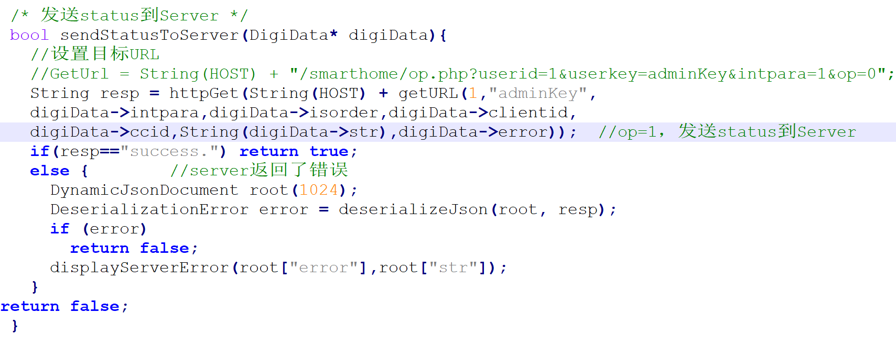
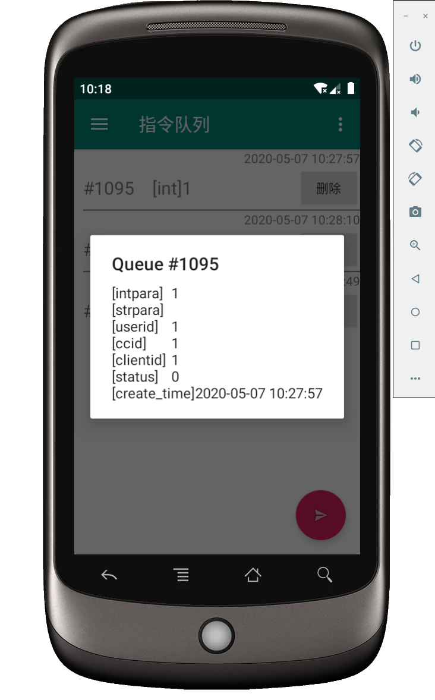
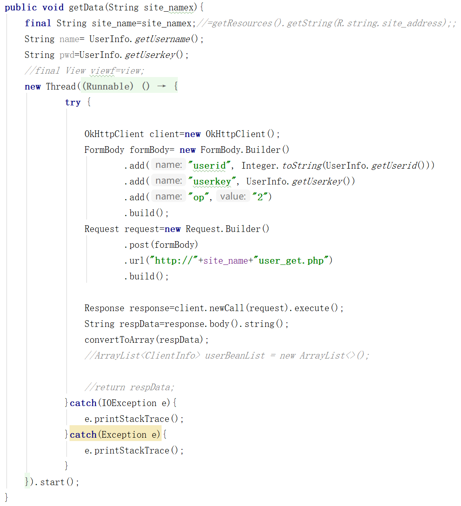
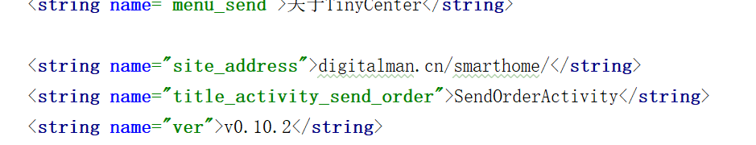
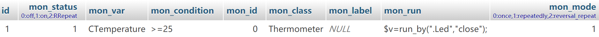

**TinyCenter | 基于云端的物联网设备控制和协同工作框架**

**  
TinyCenter | 基于云端的物联网设备控制和协同工作框架**

**摘
要：**物联网正在逐渐的进入到大众的生活当中，并即将促使人类进入下一个智能时代。尽管市面上有很多物联网管理系统，但几乎都不支持用户代码、数据监控等功能。本毕业设计提出了一个更具潜力的系统，系统对各个组件之间进行了分层、分区管理：使用中心控制器实现了信息的自动配送机制，辅助控制器提供了区分公共设备和私有设备的能力，Client端中提供了指令的标准化解析方法。而在服务器端，设备驱动将抽象的指令信息具象化，并使用类标记来同时管理那些在某方面相似的设备，自定义按钮使得用户可以快捷地完成操作；基本数据表可以存放设备的自定义数据，基本指令队列保证指令存取操作的原子性；用户代码运行环境是本系统最重要的创新和特色功能，支持用户自定义代码，该环境简单易学，不仅可以过滤危险的用户代码，内置的Userlib还为用户随时随地个性化管理设备提供了无限可能；设备选择器不仅可以依据中心控制器划分不同的管理区域，还可以根据设备的类和编号管理设备，通过不同限制的组合进行精细化管理；通过统一高效的数据监视器，实现了传感器与其他设备之间的自动化配合，以此可以实现多个设备间的协同工作，同时考虑了传感器数值变化的延迟性，设计了反向重复的算法避免了代码的重复执行；串行指令不仅可以获取指令执行成功与否，还可以在指令执行完成后自动执行用户指定的其他代码，实现了指令与指令之间的同步，有能力完成更加精细化的设备管理操作；权限控制系统规定了不同用户控制设备的范围，也可以阻止不明设备接入系统；日志系统可以记录系统中出现的错误，用户通知中心可以实时提醒用户设备的当前状态。配合Android客户端的使用，解决了许多实实在在的问题。

**关键词：**物联网 控制 协同工作 框架

**TinyCenter—IoT Control and Collaboration Framework Based on Cloud Service**

**Abstract:** The Internet of things is gradually entering into the life of the
public, and it will promote human to enter the next intelligent era. Although
there are many Internet of things management systems on the market, their
functions are not perfect. This graduation project puts forward a more potential
system, which manages the components in layers and zones: the Center Controller
is used to realize the automatic distribution mechanism of information, the
Accessiorial Controller provides the ability to distinguish public equipment
from private equipment, and the Client provides the standardized analysis method
of instructions. On the server side, the device driver visualizes the abstract
instructions, uses class tags to manage similar devices, and the user-defined
buttons enable the user to complete the operation quickly; the basic data table
can store the user-defined data of the device, and the basic instruction queue
ensures the atomicity of the instruction access operation; the user code
operation environment is the most important innovation and feature of the
system, which support user-defined code, the environment is simple and easy to
learn, not only can filter dangerous user code, but also the built-in userlib
provides unlimited possibilities for users to personalized manage the device
anytime and anywhere; the device selector can not only divide different
management areas according to the center controller, but also manage the device
according to the class and number of the device, through the combination of
different restrictions, refined management will be realized; a unified and
efficient data monitor, which realizes the automatic cooperation between sensors
and other devices, so as to realize the cooperative work among multiple devices;
serial instructions can not only obtain the success of instruction execution,
but also automatically complete the operations specified by users after
execution, so as to realize the synchronization between instructions and have
the ability to complete More refined equipment management operations; the
authority control system specifies the scope of different user control
equipment, and it can also prevent unknown equipment from accessing the system;
the log system can record errors in the system, and the user notification center
can remind the user of the current status of the equipment in real time. With
the use of Android client, many practical problems have been solved.

**Keywords:** IoT; control; collaboration; framework

**  
**

**正文目录**

[1	绪论	7](#_Toc42679715)

>   [1.1	研究背景	7](#_Toc42679716)

>   [1.2	研究目的和意义	7](#_Toc42679717)

>   [1.3	现状与发展趋势	7](#_Toc42679718)

>   [1.3.1	国内现状	7](#_Toc42679719)

>   [1.3.2	国外现状	8](#_Toc42679720)

>   [1.3.3	存在的问题	8](#_Toc42679721)

>   [1.4	论文组织结构	9](#_Toc42679722)

[2	系统需求与总体设计	10](#_Toc42679723)

>   [2.1	总体框架设计	10](#_Toc42679724)

>   [2.2	系统功能需求	11](#_Toc42679725)

>   [2.2.1	中心控制器	11](#_Toc42679726)

>   [2.2.2	辅助控制器	11](#_Toc42679727)

>   [2.2.3	设备Client端	12](#_Toc42679728)

>   [2.2.4	服务器端	12](#_Toc42679729)

>   [2.2.5	系统Android端	13](#_Toc42679730)

>   [2.3	相关技术概述	14](#_Toc42679731)

>   [2.4	本章小结	15](#_Toc42679732)

[3	嵌入式设备的软件设计和实现	16](#_Toc42679733)

>   [3.1	中心控制器	16](#_Toc42679734)

>   [3.1.1	总体设计	16](#_Toc42679735)

>   [3.1.2	模块ParseData	17](#_Toc42679736)

>   [3.1.3	模块CloudHandler	17](#_Toc42679737)

>   [3.1.4	模块AccessorialControllerHandler	18](#_Toc42679738)

>   [3.1.5	模块MQTTHandler	18](#_Toc42679739)

>   [3.1.6	类CenterController	19](#_Toc42679740)

>   [3.2	辅助控制器	21](#_Toc42679741)

>   [3.2.1	总体设计	21](#_Toc42679742)

>   [3.2.2	信息的获取和发送	21](#_Toc42679743)

>   [3.2.3	系统的离线运行	22](#_Toc42679744)

>   [3.3	Client设备	23](#_Toc42679745)

>   [3.3.1	简述	23](#_Toc42679746)

>   [3.3.2	响应用户指令——修改justRunOrder函数	23](#_Toc42679747)

>   [3.4	使用屏幕——一个应用辅助控制器的实例	25](#_Toc42679748)

[4	云端软件设计和实现	27](#_Toc42679749)

>   [4.1	基本框架综述	27](#_Toc42679750)

>   [4.1.1	综述	27](#_Toc42679751)

>   [4.1.2	设备信息的存储方式	27](#_Toc42679752)

>   [4.1.3	新设备的接入	28](#_Toc42679753)

>   [4.2	设备驱动	28](#_Toc42679754)

>   [4.2.1	指令的结构	28](#_Toc42679755)

>   [4.2.2	设备的类	28](#_Toc42679756)

>   [4.2.3	设备驱动的含义	29](#_Toc42679757)

>   [4.2.4	设备驱动的查找方式	29](#_Toc42679758)

>   [4.2.5	快捷操作——自定义命令按钮	30](#_Toc42679759)

>   [4.3	基本数据表	30](#_Toc42679760)

>   [4.3.1	基本数据表的含义	30](#_Toc42679761)

>   [4.3.2	更新、修改和删除	31](#_Toc42679762)

>   [4.4	基本指令队列	31](#_Toc42679763)

>   [4.4.1	什么是基本指令队列	31](#_Toc42679764)

>   [4.4.2	循环过程	32](#_Toc42679765)

>   [4.5	用户代码运行环境	32](#_Toc42679766)

>   [4.5.1	使用SaferEval	33](#_Toc42679767)

>   [4.5.2	使用Userlib	33](#_Toc42679768)

>   [4.5.3	设备选择器	35](#_Toc42679769)

>   [4.6	数据监视器及其抽象形式	36](#_Toc42679770)

>   [4.6.1	基本运行过程	37](#_Toc42679771)

>   [4.6.2	数据监视器的抽象形式	38](#_Toc42679772)

>   [4.6.3	选中和激活	38](#_Toc42679773)

>   [4.6.4	三种运行模式	39](#_Toc42679774)

>   [4.6.5	反向重复模式的一个例子	40](#_Toc42679775)

>   [4.7	串行指令队列	41](#_Toc42679776)

>   [4.7.1	使用serial_run函数	42](#_Toc42679777)

>   [4.7.2	使用串行指令队列——以serial_run函数为例	42](#_Toc42679778)

>   [4.8	权限控制	43](#_Toc42679779)

>   [4.8.1	简述	43](#_Toc42679780)

>   [4.8.2	设备的“所有者”（Owner）	43](#_Toc42679781)

>   [4.9	信息反馈——日志和用户通知系统	43](#_Toc42679782)

>   [4.9.1	日志系统	43](#_Toc42679783)

>   [4.9.2	用户通知系统	44](#_Toc42679784)

>   [4.10	与Android客户端的信息交互	44](#_Toc42679785)

[5	Android客户端软件设计	46](#_Toc42679786)

>   [5.1	用户登录页面	46](#_Toc42679787)

>   [5.2	设备信息页面	46](#_Toc42679788)

>   [5.2.1	所有设备	47](#_Toc42679789)

>   [5.2.2	指令队列	47](#_Toc42679790)

>   [5.2.3	监视器	48](#_Toc42679791)

>   [5.2.4	日志	48](#_Toc42679792)

>   [5.2.5	通知	49](#_Toc42679793)

>   [5.2.6	关于	49](#_Toc42679794)

>   [5.3	用户代码页面	50](#_Toc42679795)

>   [5.4	实现模型	50](#_Toc42679796)

[6	实验与测试	53](#_Toc42679797)

>   [6.1	前期准备	53](#_Toc42679798)

>   [6.2	实时温度计	54](#_Toc42679799)

>   [6.2.1	准备工作	54](#_Toc42679800)

>   [6.2.2	观察信息	55](#_Toc42679801)

>   [6.3	数据监视器和快捷按钮	56](#_Toc42679802)

>   [6.3.1	准备工作	56](#_Toc42679803)

>   [6.3.2	操作与信息观察	57](#_Toc42679804)

[7	总结和展望	59](#_Toc42679805)

[参考文献	60](#_Toc42679806)

# 

# 绪论

## 研究背景

物联网的概念最早在1995年被提出[1]，在比尔盖茨的《The road
ahead》一书中描述了相关的场景[2]。但是受限于的计算机科学和传感器技术，这个概念没有引起广泛的关注。1999年，美国Auto-ID重新提出了使得射频标签技术与互联网结合的设想，与物联网的概念不谋而合，引起了关注。2005年11月，国际电信联盟（ITU）在突尼斯举行了信息社会世界峰会（WSIS），会上发布了《ITU
Internet Reports 2005：The Internet od
Things》，“物联网”的概念被正式提出[3]。2009年1月，IBM首席执行官提出了“智慧地球”的构想，希望使用互联网将物联网整合起来，使得人类可以用更加精细和动态的方式管理生产和生活。物联网通过智能感知、识别技术与普适计算、泛在网络的融合应用，被称为继计算机、互联网之后世界信息产业发展的第三次浪潮。物联网也被认为是互联网的应用拓展，应用创新是物联网
发展的核心，而以用户体验为核心的创新是物联网发展的灵魂。根据CISCO的报告，世界物联网设备数量在2020年将达到500亿个。世界物联网的潜在经济影响为为每年2.7万亿美元至6.2万亿美元。因此，物联网行业具有十分广阔的市场和应用前景[4]。

## 研究目的和意义

本系统使用MQTT协议和WiFi技术在物与物之间建立联系[5]，可以节约人力物力资源，提升效率。通过将物联网系统接入云端，无论用户身处何方都可以快速地控制整个系统。同时还提供了Android端应用程序，方便用户对系统的控制和状态的查看。本文提出的物联网管理框架被命名为TinyCenter，是开源框架，实现了物联网管理系统所需的基本功能，同时进行了一些创新，如提供用户代码运行环境和提出了“类”的概念等，或许可以为以后的研究提供一些思路。

## 现状与发展趋势

### 国内现状

随着时间的推移，国内的物联网管理平台逐渐成熟[6]，国内提供物联网管理平台的有阿里云、华为云等，下面对它们进行一些简单介绍。

华为顺应物联网的发展浪潮，通过APIs开放、业务编排以及数据开放来使产品降低成本、缩短开发周期。同时提供面向人与物系列化的SDK，提供强大的通信能力，数据采集能力，设备控制能力以及实时交互能力，用户可以根据自己的产品需求快捷地申请和调用这些功能[7]。

阿里云物联网平台为设备提供安全可靠的连接通信能力，提供云端API，服务端通过调用云端API将指令下发至设备端，实现远程控制，物联网平台也提供了其他增值能力，如设备管理、规则引擎等，扩展了物联网平台的功能[8]。

### 国外现状

国外的物联网技术也十分先进，目前排名靠前的有AWS、Google Cloud
IoT等，下面对它们进行介绍。

通过AWS物联网核心，设备可以连接到互联网，设备之间也可以交换数据。通过安全连接，可以在设备和云存储之间发送数十亿条消息，该平台支持各种通信协议，包括自定义协议，从而实现不同制造商设备之间的通信[9]。

谷歌云平台是另一个支持物联网解决方案的全球云提供商。云物联网核心是谷歌云物联网套件的核心，允许连接各种设备并收集其数据，谷歌云支持云发布/订阅，处理事件数据并提供实时流分析的服务，另外，谷歌云也支持云机器学习引擎，允许建立ML模型和使用从物联网设备接收的数据[10]。

### 存在的问题

经过研究与分析，发现目前市场上的物联网管理系统主要存在以下问题：

（1）几乎没有提供统一的数据内容监视及反应功能。如阿里云仅提供在线设备数量、上下行消息数量、设备网络状态等指标数据的实时监控功能，而没有提供数据内容的监控功能；

（2）没有提供用户代码运行环境，控制设备需要在服务器端预设动作，操作较为复杂；

（3）没有提供设备的分区管理功能，也没有明确区分公共设备和私有设备的能力；

（4）更多地应用于企业领域，价格较高，学习成本较高。

## 论文组织结构

本文共分为六个章节，章节简要安排如下：

第一章绪论。主要介绍背景、研究的目的和意义、国内外现状及存在的问题；

第二章系统需求与总体设计。对系统进行了总体分析，包括总体框架设计、系统功能需求和相关技术概述；

第三章嵌入式设备的软件设计和实现。对中心控制器、辅助控制器和Client设备进行的软件设计展开描述；

第四章云端软件设计和实现。对云端的软件设计和功能进行具体描述；

第五章Android客户端软件设计。基于云端的功能对Android客户端的软件设计进行描述；

第六章功能测试。举出了几个实例，并对其进行了系统流通性和完整性测试。

第七章总结与展望。总结了完成系统过程中所做的工作，指出系统的优缺点，对课题对未来的研究方向和系统待提高的技术做出了展望。

# 系统需求与总体设计

## 总体框架设计

>   

图 21整体结构框架图

整套系统的整体结构如下：

1.
云端（Server，也称Cloud）负责收集来自公网中的指令（Order），将其发布给中心控制器；

2\. 中心控制器（Center
Controller，CC）负责指令的转发和设备的分割管理，是类似网关的角色；

3\. 辅助控制器（Accessorial
Controller，AC）负责管理一些固定设备（如屏幕、语音控制器等），同时也可以监控Client的状态和发布指令。AC可以使整套系统在无法连接到Server的情况下脱机运行；

4\. 设备端（Client）负责连接和管理具体的嵌入式模块（如电灯等）。

>   

图 22指令发出与接受流程简图

当指令到达云端时，服务器端通过指令队列发布一个公告（Announcement），中心控制器会定期查看这个公告，并将该指令下载和分解，中心控制器会智能地选择指令的出口，即，选择将指令发送到设备端（Client）还是发送到辅助控制器。Client执行完成后会自动（强制）将完成后的状态信息返回给中心控制器，以即时地更新服务器端上的信息。

Client不能给其他的Client发送指令，但可以给辅助控制器发送特殊指令（Special
Order），以便控制屏幕的显示信息或其他。

同时，每个Server可以与多个Android
App、多台中心控制器连接，每台中心控制器可以与多个Client相连。每个中心控制器可以连接一个辅助控制器。

## 系统功能需求

### 中心控制器

“中心控制器”（Center Controller）是云端与设备数据之间传送的桥梁。

图 23整体结构示意图

如图示，一个TinyCenter系统中拥有多个中心控制器，每个中心控制器管辖多个Client设备和一个辅助控制器。

中心控制器需要向云端、辅助控制器和Client设备分别请求信息，将其分解后得到目的地址，并选择正确的路径将其发送出去。

配合设备选择器，中心控制器也可以提供设备的分区管理功能。

### 辅助控制器

“辅助控制器”（Accessorial
Controller）可以帮助完成多数设备所共同期望的功能，并对它们进行汇总。辅助控制器提供了区分公共设备与私有设备的能力：与辅助控制器直接相连的设备为公共设备，而2.2.3节描述的普通Client设备可看作私有设备。出于安全性的考虑，私有设备之间不能直接发送信息，但私有设备与公共设备（也称辅助设备）可以。举例来说，辅助控制器上可以外接一个屏幕，该中心控制器所管辖的所有设备都可以在这块屏幕上显示自己的信息给用户，而不需要所有的client都自行安装屏幕，这样可以在没有服务器端的时候对所有设备的状态进行检查。

>   

图 24辅助控制器示意图

如图，辅助控制器可以连接多个辅助设备，如屏幕、语音识别、扬声器等。使用辅助控制器，多个Client设备可以共享一块屏幕、一个扬声器等，也可以使用一个语音识别模块进行统筹调用。

###  设备Client端

>   “Client端”又称设备端，可以简称为“设备”，与之前的辅助设备不同，Client端可以由服务器或辅助控制器直接调度，是最终接收指令的设备。

>   通过对指令的解析和修改justRunOrder函数，Client端可以完成的工作多种多样，但在指令执行完成后，设备端必须将其当前的状态上传至服务器端，使服务器端可以实时获得最新的数据。

>   在本文中，Client使用NodeMCU作为运行载体。只要遵循相应的数据传输协议，也可以使用其他类型的开发板。

### 服务器端

>   服务器端实现的功能包括用户代码的执行、数据的监控和存储以及信息反馈等。

图 25服务器端的功能示意图

服务器端的整体结构如上图。

首先，服务器端实现了“基本数据表”功能，Client设备可以上传自己的信息到基本数据表，并对其进行修改。“数据监视器”在基本数据表被修改时检查之，若发现数据表中的数据内容符合某个条件，则自动调用SaferEval和Userlib并执行一段用户代码。

用户可以执行特定的用户代码，该代码为PHP语法。为了限制用户代码，禁止其执行某些危险操作，所有的用户代码都必须在SaferEval下调用Userlib执行。用户也可以自定义一些“快捷按钮”，按钮直接对应设备的驱动项。驱动负责将某个驱动函数翻译成设备的指令信息。Userlib还可以使用设备选择器，同时选择多个设备发出相同的指令，设备选择器配合中心控制器可以完成设备的分区管理。Userlib也可以使用设备驱动向设备发送指令。

发出的指令信息被存储在指令队列中。基本指令队列和串行指令队列共享同一个指令队列，但基本指令（也称并行指令）的id值为正数，而后者为负数。基本指令的执行顺序不确定，而串行指令会附带有明确的执行顺序的用户代码。在服务器中两者兼有时，抽取一条指令并发出“公告”的顺序不确定。

最后，服务器端支持日志系统和用户通知系统。前者可以用来记录系统中出现的各种错误信息，而后者可以被Userlib直接调用，向用户直接发送通知信息。

###  系统Android端

Android端主要实现了信息的展示和发送。通过服务器端，Android端可以直接执行用户代码并发送指令。

Android端包括用户登录和信息展示和处理功能，可以获取设备、指令队列、监视器、日志和通知的所有内容，也可以发送一段用户代码。

## 相关技术概述

1.  **NodeMCU**

NodeMCU是中心控制器、辅助控制器和Client设备的载体。下图为NodeMCU模块[11]：

图 26 NodeMCU

1.  **ArduinoJson**

ArduinoJson是嵌入式系统中优雅和高效的Json库，用于分解和组装JSON数据。它仅使用最基本的API，确保工作时消耗最小的内存空间。ArduinoJson可以应用在任何的C++项目中。TinyCenter嵌入式设备使用ArduinoJson分解和拼装各种数据。

1.  **PHP**

云端使用PHP语言开发。PHP 是一种 HTML
内嵌式的语言，是一种在服务器端执行的嵌入HTML文档的脚本语言，语言的风格类似于C语言，现在被很多的网站编程人员广泛的运用。

1.  **MQTT协议**

MQTT协议是一个基于客户端-服务器的消息发布/订阅（publish / subscribe
）传输协议，该协议的构建是基于TCP/IP协议的[11]。MQTT在该系统中运用在硬件和服务端进行交互，用户获取LCD显示信息，改变LED状态。服务端发布Topic，硬件端订阅Topic。使用主要使用了NodeMCU开源的物联网开发平台，集成了WiFi芯片ESP8266的最小系统板来进行开发[5]。在TinyCenter中，MQTT模块被使用来实现Client和中心控制器之间的信息交互。

## 本章小结

>   本章展示了TinyCenter的整体结构和功能，并对相关技术进行了概述。这些功能的具体情况将在之后的章节展开叙述。

# 嵌入式设备的软件设计和实现

## 中心控制器

中心控制器是TinyCenter中信息传输的桥梁，可以同时沟通服务器端、辅助控制器和设备端（设备端将从MQTT订阅流获取数据）。同时中心控制器也有助于将设备分块管理，将某些指令限制在中心控制器内（详见4.5.3设备选择器）。

### 总体设计

下图为中心控制器的内部实现，图中的中心控制器方框可以看作CenterController类。

>   

图 31中心控制器

可以看到，服务器端、辅助控制器和MQTT订阅流分别有一个沟通组件，分别为CloudHandler、AccessorialControllerHandler和MQTTHandler，分别负责将收到的数据进行收集汇总。服务器与中心控制器之间的信息传输通过TCP进行，而辅助控制器使用软串口；Client设备使用MQTT与中心控制器通信。ParseData模块负责将收到的JSON指令进行分解，并由CenterController选中合适的出口将数据传送出去。其中的digiMQTT是与MQTT订阅流直接沟通的底层模块，由MQTTHandler调用。

图 32使用CenterController类

在使用中心控制器时，需要定义DigitalmanCenterController类，可以设置一个AccessorialControllerHandler指针包含其中。

### 模块ParseData 

ParseData模块包含parseVCData函数和convertDigiDataToJson函数等，分别用来实现JSON的分解与合成。

图 33 JSON数据的转化

在中心控制器的ParseData模块中还规定了其唯一的Ccid。

### 模块CloudHandler 

CloudHandler模块负责与云端交换数据。其核心为httpGet函数，用于请求HTTP信息，以便获得服务器上的“公告”信息。

图 34获得HTTP信息

使用sendStatusToServer函数可以将一个DigiData数据（详见3.3.2.1节）发送到服务器。

图 35发送DigiData

### 模块AccessorialControllerHandler 

AccessorialControllerHandler模块负责通过软串口与辅助控制器交换数据。通过digiDetectVoiceOrder函数获取来自辅助控制器的信息，通过sendStringToAC函数将数据输送到辅助控制器。

图 36辅助控制器控制模块

图 37检测软串口

### 模块MQTTHandler 

MQTTHandler模块包含一个digiMQTT模块，负责处理digiMQTT模块发回的信息，并控制其状态。使用handlePayload可以分解接收到的信息。

图 38处理MQTT消息

### 类CenterController 

#### 概述

CenterController类继承于ParseData类，同时统筹AccessorialControllerHandler、CloudHandler和MQTTHandler模块。

图 39 CenterController类

函数workOnce会统一检测一次所有信息的入口并处理它们，需要在loop函数中调用它。

图 310 workOnce函数

图 311 Loop函数

在setup函数中，我们需要连接wifi，并使用startCCServer函数开启中心控制器。

图 312 Setup函数

#### 可靠的快递员——“数据配送”机制

数据配送机制是指，无论是设备端、服务器端还是辅助控制器，对于任何需要传输的数据，使用者只需要指定数据的内容和接受者，TinyCenter会自动选择数据的传送路径，并最终将其输送至正确的位置。

数据目标位置信息的确定需要数据中isorder字段的参与（参考3.3.2.1节）。若isorder=1，则该数据为服务器发送给设备端的数据；若isorder=0，则该数据为设备端返回给服务器端的状态信息；若isorder=2，则该数据为设备在操作基本数据表；若收到client发来的isorder=1的数据，则观察其intpara字段是否为特定值，以确定该指令是否应该传输给辅助控制器。

我们来看看数据的传送方向有哪些可能。

首先，服务器端-设备端，这是最常见的数据传输方向，服务器端需要向设备端发送指令，设备端需要向服务器端返回其状态和错误信息，设备端还会向服务器端发送请求进行改变其基本数据表等操作，这些操作的数据都需要途经中心控制器进行处理。

我们知道，在一个独立的TinyCenter系统中，可能存在多个中心控制器，每个中心控制器可能管辖着多个设备。为了知道设备的具体位置，在设备接入网络时，需要首先通过MQTT订阅流向中心控制器发送一条“上线信息”，该信息会包含设备当前的状态。中心控制器将该“上线信息”加上自身标识（CCid）后将其传输给服务器，最终该信息将会被登记在服务器上。当服务器需要向设备发送指令时，会自动抽取其CCid信息，在中心控制器向服务器请求指令时进行过滤（4.4.1节，表中的CCID项）。例如，2号设备目前被1号中心控制器管辖，该中心控制器请求指令时会附带其ccid（=1），服务器仅返回与该中心控制器有关的一条指令，再由中心控制器发送到与设备标识（clientid）有关的一个MQTT订阅流中，设备通过digiMQTT模块即可读取。

设备在返回值时，会将信息放入到MQTT流中，中心控制器读取信息后通过GET方式返回到服务器端。

其他的几条路径，如设备端-辅助控制器甚至服务器-辅助控制器之间的数据传输均由中心控制器的CenterController类将信息分拣并选择相应的出口传输，在此不再赘述。

## 辅助控制器

### 总体设计

辅助控制器最初被设计用来承载语音控制端。TinyCenter规定，Client设备之间不能直接传输指令，想要实现类似的功能必须通过Userlib和数据监视器，但辅助控制器可以直接接收和发送设备指令。辅助控制器与中心控制器通过软串口直接相连。

图 313辅助控制器

图中的设备指的是辅助设备，与Client设备有本质的不同。如果将这些辅助设备看作某种资源，那么它们被该中心控制器下的所有Client设备所共享。

### 信息的获取和发送

在辅助控制器的setup函数中首先进行软串口的安装。

图 314 Setup函数

在Loop函数中处理要接收和发送的信息。

图 315 Loop函数

如果存在要发送的指令，只需要调用entityVData函数，haveVoiceOrderToSend函数就会返回真值。

图 316 发送指令

在执行指令时，我们需要修改辅助控制器中的runOrder函数，原理与Client中的justRunOrder函数一致（参考3.3.2节）。

图 317 解释指令

### 系统的离线运行

上图中的“设备”是附加设备，与Client设备是不同的概念。辅助控制器可以连接的设备包括语音识别器、屏幕等，这些设备的资源被所有Client设备所共享。例如语音识别，通过辅助控制器实现的简单语音识别功能可以比服务器端更加快速高效。更加神奇的是，辅助控制器可以使得整个系统在脱机状态下运行，即使服务器端断网，也可以应急启动。

辅助控制器可以处理多个附加设备的信息，可以接收从Client设备传来的特殊指令，也可以通过中心控制器向它们发送指令。

用户可以选择连接或不连接辅助控制器，在不连接辅助控制器时，应当在CenterController类创建时，将辅助控制器选项置为NULL。

## Client设备

### 简述

Client设备是整套系统所最终操纵的设备，也简称作“设备”，是指令的最终接受者之一（辅助控制器也可以接受指令）。

图 318 Client设备

如图示，Client中包含一个digiMQTT类，该类是与MQTT订阅流沟通的底层模块。在接收到指令后，convertData函数会负责分解指令，并将其交给runOrder函数运行。

### 响应用户指令——修改justRunOrder函数

#### 使用DigiData类

DigiData类用于存储分解后的数据信息，如下图：

图 319 DigiData类

其中isorder字段用于规定数据的类型，可以以此判断数据的流向，error字段为错误信息，ccid为参与数据传输的中心控制器标识，clientid为目标设备（或源设备）标识，intpara和str用于规定指令（或状态数据）的具体内容。

在Client设备中，有一个DigiData类型的全局变量myStatus，用于存储设备的当前状态。runOrder函数会在指令执行完成后自动上传myStatus的内容。

分解操作由parseVCData函数完成，将DigiData转换为JSON格式由convertDigiDataToJson函数完成，这两个函数的代码与3.1.2节类似，这里不再赘述。

#### 使用justRunOrder函数

指令由runOrder函数进行具体执行，如下图。这里的广播指令功能暂未完成，isPrivate通常直接置为0，intPara为-2时，代表服务器仅仅是在请求设备的当前状态，isorder为负数代表该指令为串行指令（详见4.7节）。

图 320 runOrder函数

runOrder函数会调用justRunOrder函数，该函数包含一个digiData参数，是收到的指令分解后的结果，用户的自定义代码可以自由地对指令进行筛选运行；之后会调用sendMyStatus函数强制返回设备当前的状态给服务器（sendMyStatus函数也需要调用convertData转换数据），以实现服务器与设备的状态信息同步。

图 321使用justRunOrder函数

如图示，若收到的指令中intpara值为1，则打开灯并通过辅助控制器在屏幕上写上“Light
on”字样，反之依然。若函数的返回值为true，则代表指令执行成功，否则返回false。该项会在返回信息中的error字段有所体现，在串行指令相关内容中会在之后具体阐述。

换言之，用户只需要修改justRunOrder函数，就可以实现对指令的分别执行。同时，使用setMyIntPara等函数修改设备等当前状态，使之与服务器同步；使用setDataTable函数可以对基本数据表进行修改和更新。

## 使用屏幕——一个应用辅助控制器的实例

我们在这里编写一个简单的实例，来应用辅助控制器的具体使用。我们需要达成的效果是，当Client设备执行完自己的指令后，向中心控制器发送一个特殊指令，动态地修改LCD屏幕（与辅助控制器直接相连）上的文字。

下图中的displayOnTheScreen函数在Client设备中定义，参考3.3节中justRunOrder函数中的内容（DISPLAY_ON_THE_LCD的值为-5）：

图 322 displayOnTheScreen函数

修改中心控制器中的detectMessageFromClientsAndHandle函数，使之将数据正确转发：

图 323 detectMessageFromClientsAndHandle函数

下图中的displayOnTheScreen函数在中心控制器中定义。为了处理该信息，我们需要在中心控制器中的AccessorialControllerHandler模块中自定义一个displayOnTheScreen函数，用于向辅助控制器发送屏幕显示信息。

函数displayOnTheScreen将intpara置为DISPLAY_ON_THE_LCD，可以直接使用AccessorialControllerHandler模块中定义的sendStringToAC函数将其转发到辅助控制器的软串口上。

图 324 函数displayOnTheScreen

辅助控制器会自动解析收到的数据并将其转化为DigiData数据。在辅助控制器中，有一个runOrder函数（与Client设备中的justRunOrder函数功能一致），我们对其进行一些修改，使之能够识别从中心控制器转发而来的指令：

图 325 runOrder函数

其中的displayString函数负责将文字显示在LCD屏幕上。

图 326 displayString函数

# 云端软件设计和实现

## 基本框架综述

云端是TinyCenter管理、处理信息的最重要的地点，承担着大部分的功能任务，是TinyCenter最重要的部分。

### 综述

云端支持的功能包括用户指令、数据监控、数据存储和信息反馈等，分别由不同的模块完成。其中Userlib是云端的中枢模块，可以由用户通过SaferEval调用。

### 设备信息的存储方式

在TinyCenter中，设备信息被存储在服务器的digitalmandemo表中（这些信息多数是由设备的“上线信息”提供，见3.1.6.2节），包括唯一的设备标识clientid、所有者标识userid、名称name、设备描述clientdesc、状态信息、显示权限isDisplay、隶属的中心控制器编号ccid、类信息class_name、基本数据表信息data_table和快捷按钮信息buttons。

| **名称**      | **类型**    | **含义**       | **描述**                                                                                                |
|---------------|-------------|----------------|---------------------------------------------------------------------------------------------------------|
| Clientid      | Int         | 设备标识       | 每个设备都有一个唯一的clientID                                                                          |
| Userid        | Int         | 所有者标识     | 每个设备都有一个唯一的所有者Owner                                                                       |
| Name          | Text        | 名称           | 设备名称，由用户指定                                                                                    |
| Clientdesc    | Text        | 描述信息       | 设备描述信息，由用户编写                                                                                |
| Status        | Int         | 状态信息       | 整型状态信息                                                                                            |
| Status_string | Text        | 状态信息       | 状态信息的补充，字符串类型                                                                              |
| isDisplay     | Text        | 显示权限       | 控制该设备可以由哪些用户查看                                                                            |
| CCid          | Int         | 中心控制器标识 | 指定该设备隶属于哪个中心控制器                                                                          |
| Class_name    | Text        | 类信息         | 指定该设备属于哪些类                                                                                    |
| Data_table    | Text (JSON) | 基本数据表信息 | 以JSON格式存储的基本数据表信息                                                                          |
| Buttons       | Text (JSON) | 快捷按钮信息   | 以JSON格式存储的快捷按钮信息，对应的动作为设备的驱动项，这些按钮将可以在Android客户端中被用户直接使用。 |

表 41 digitalmandemo表

### 新设备的接入

Client设备在启动并接入网络时，会自动通过“数据配送”功能向服务器发送自身的上线信息，包括上表中的大部分内容。

一个以前从未接入过TinyCenter的设备尝试接入框架时，服务器会首先验证其权限。在被允许后，服务器会自动在数据库中插入该设备的信息，无需用户的手动干预。

## 设备驱动

使用设备驱动，用户可以从各种繁杂的数字代码中解脱出来，减轻其编写用户代码的负担。设备驱动系统可以将驱动函数翻译成具体的指令。

### 指令的结构

在TinyCenter中，“指令”一词代表一个整数变量（intpara）和一个字符串变量（strpara）的组合。通常在完成简单的指令如开、关灯时，我们可以将strpara置空，仅仅保留intpara项，但是在复杂场景中，可以将intpara置为指令的类型，再在strpara中进一步阐释。在TinyCenter中，我们一般只需要指定具体的指令值以及目标设备集合，“数据配送”机制会自动寻找数据的传输路径，并正确地将指令数据输送到目标。

### 设备的类

有时，我们会希望同时管理多个类似的设备。它们或者有着一致或部分一致的指令结构，或者有一致或部分一致的基本数据表项。在TinyCenter中，我们用“类”来标识那些在某些方面特性一致的设备。

每个设备可以拥有多个类，每个类也可以标记多个设备，这些设备可以作为设备选择器的限制条件，在数据监视器和用户代码执行的时候被共同选择（详见4.5.3节）。

### 设备驱动的含义

在TinyCenter中，“设备驱动”（Client
Driver）代表着一种对应关系。由于指令的内容一般比较抽象，如我们定义“开灯”代表intpara值为1，“关灯”代表intpara值为0，直接使用具体的指令值并不方便，因此我们可以使用一个“函数名”来代表指令。例如使用“open”代表intpara为1，“close”代表intpara为0。

设备驱动被存储在数据库的digi_drv表中，包含一个唯一的ID、函数名、整型变量intpara、字符串变量string_para、驱动所属的设备标识belong_to_id、所属的类标识belong_to_class以及版本信息version。

一个设备驱动函数对应着一条指令值。对于某个设备驱动函数而言，其必须对应一个intpara值，但指令中的string_para项可以预设或留空，也可以由用户指定。因此，设备驱动函数可以携带一个字符串参数，也可以不带参数。如果需要用户指定strpara参数，可以在设置驱动时将其string_para字段指定为“WAITING_FOR_SETTING”，在驱动执行时会自动将用户指定的strpara填充到生成的指令中。

### 设备驱动的查找方式

设备驱动可以按设备标识（clientid）查找，也可以按类查找，因此，可以为多个设备指定某些相同的驱动项，例如在拥有多个相同的Led灯时，设备驱动中的“open”函数可以对应“Led”类，使得多个Led设备共享一个驱动项。

在查找一个驱动项时，为了查找结果的合理性和准确性，首先应该按设备标识查找，若找不到合适的结果，则继续按照类查找。在找到多个可能匹配的驱动项时，belong_to_id对应的项为最优先，其次为belong_to_class，最后选择最新的项，即version字段最大的项输出。

### 快捷操作——自定义命令按钮

在4.1.2节中，我们看到一个Client在服务器上的基本数据包括Buttons列，该列可以存储自定义快捷按钮。

图 41 Buttons项

如图我们可以看到，该Client拥有两个快捷按钮，分别为“Open”和“Close”，对应的驱动函数为“open”和“close”，驱动系统会将其翻译成具体的指令内容并发送出去。快捷按钮的具体演示可以在5.2.1节找到。

除了name、func项，用户也可以定义string_para项对应驱动函数的stringpara参数。若没有该参数，则可以省略该项。

## 基本数据表

基本数据表用于设备各类信息的存放，服务器端的多种基本功能会围绕基本数据表展开。

### 基本数据表的含义

在服务器端，每个Client设备都会拥有一个基本数据表，用于数据的记录或其他操作，基本数据表在Client离线时会继续保持数据。基本数据表的形式为K-V对，使用JSON格式存储，可以被Client设备更新、添加和删除，也可以被用户代码读取。

图 42基本数据表

如上图，第一个设备拥有“ok”和“okx”项，下面的设备拥有“CTemperature”项，对应各自的数据。

### 更新、修改和删除

>   在Client端更新基本数据表：

>   

图 43更新基本数据表

首先，使用ArduinoJson将需要更新的数据转换成Json格式，再新建一个DigiData类，将isorder字段置为2，代表这是对基本数据表的操作指令，intpara置为0，表示更新或添加数据。如上图所示，CTemperature字段被设置为当前的温度。服务器在收到并分解该指令后，会首先检查设备中原有的基本数据表，如果其中不包含CTemperature字段，则会先创建该字段，然后将对应的值填入其中。

服务器端的op.php在接收到指令后，发现isorder字段为2，则会执行setDataTable函数，该函数分别分解服务器中已有的基本数据表和新上传的数据，将新上传的数据与原有的数据表合并后，再使用json_encode函数将新的基本数据表保存在服务器的数据库中。

若将intpara字段置为1，则代表删除对应的基本数据表的项，原理相似，这里不再赘述。

## 基本指令队列

### 什么是基本指令队列

“基本指令队列”（Basic
OrderQueue，BOQ）是存在于服务器上的一个队列，用于存放已经发出的所有指令信息。队列中的每个项都包含以下数据：一个唯一的指令标识orderid（必须为正数，不断累加）、指令的具体内容（包含intpara和strpara）、目标设备标识clientid、目标所在的中心控制器标识ccid、指令发送者userid、状态status和创建时间。其中的ccid可以由clientid在digitalmandemo表中的项推断出来。

| **列名**    | **类型** | **意义**             |
|-------------|----------|----------------------|
| Orderid     | Int      | 指令唯一标识         |
| Orderstring | Text     | 指令中的Strpara      |
| Userid      | Int      | 发出指令的用户id     |
| Ccid        | Int      | 目标Client所在的CCID |
| Clientid    | Int      | 目标Client           |
| Ordernum    | Int      | 指令中的intpara      |
| Status      | Int      | 指令状态             |
| Createdate  | Datetime | 创建时间             |

表 42 dmorderqueue表

当目标设备不止一个时，Userlib将会循环地在指令队列中添加数据，换言之，对指令队列中的某一个项而言，其clientid字段只能对应一个目标设备，如果想对多个设备发送相同的指令，就必须循环地再创建一个新的指令队列项。

在指令最初被添加到指令队列中时，其状态（status）字段会被置为0，表示该指令目前是“未读”状态，在中心控制器从服务器端请求指令时，服务器会从未读指令中抽取一条反馈给中心控制器，并将该指令的状态字段置为1，代表“已读”。

>   用户不能够直接操作基本指令队列，而必须通过“设备驱动”来添加指令。

### 循环过程

在中心控制器每次请求指令时，服务器会从指令队列中抽取一个未读指令，将其交给中心控制器后，再将其设为已读状态。在抽取指令的过程中，服务器会核对该条指令的CCID项是否与请求指令的中心控制器的标识一致，若不一致，则跳过该条指令。

## 用户代码运行环境

用户代码运行环境是TinyCenter的特色和精华之一。用户可以通过自己编写代码操控所有的设备。它以PHP为语法，在兼顾简单易学的同时，保证了安全性，并给予了用户更大的自由度。

### 使用SaferEval

TinyCenter允许用户执行自定义PHP代码，但执行用户PHP代码对服务器的风险极大，因此TinyCenter中内置一个SaferEval组件，用于限制用户PHP代码的危险行为。

图 44 SaferEval

SaferEval组件是基于GPL协议的开源组件，存在于服务器代码的safer_eval目录下，包含配置文件config.safereval.php和主体class.safereval.php。而example.php文件负责调用功能。

SaferEval首先检查用户代码中大括号的完整性；为了检查其语法错误而不运行用户代码，将整个代码装入if(0)中，再在PHP环境下运行。接着使用正则表达式屏蔽掉意料之外的可执行代码，不允许用户自定义Lambda表达式。最后匹配用户指定的安全函数和变量，如果发现范围之外的函数和表达式，则立刻终止代码的运行并报告错误。

### 使用Userlib

在SaferEval中运行的用户代码可以调用Userlib库对设备进行一系列操作。在使用Userlib时，必须先指定当前的clientid。Userlib目前支持多个函数，如下表：

| **函数名**          | **参数（=默认值）**                                                                    | **对应动作**                                                                 | **返回值**                                                      |
|---------------------|----------------------------------------------------------------------------------------|------------------------------------------------------------------------------|-----------------------------------------------------------------|
| get_client_id       | \$clientid=0                                                                           | 查询设备标识                                                                 | 若参数为0，则返回当前clientid，否则直接返回参数值。             |
| get_userid          | 无                                                                                     | 查询用户ID                                                                   | 用户ID                                                          |
| get_ccid            | \$clientid=0                                                                           | 查询当前中心控制器标识                                                       | 当前CCID                                                        |
| get_data_table_item | \$item_name \$clientid=0                                                               | 查询基本数据表的项                                                           | 若clientid为0，则查找当前设备，否则查找指定clientid对基本数据表 |
| get_status          | \$clientid=0                                                                           | 查询设备的状态值                                                             | 若clientid为0，则返回当前设备的状态，否则返回对应设备的状态     |
| get_string_status   | \$clientid=0                                                                           | 查询设备的状态字符串                                                         | 类似以上                                                        |
| send_msg            | \$type \$title \$content                                                               | 向用户发送消息                                                               | 无                                                              |
| send_bare_msg       | \$content                                                                              | 等同于send\_msg(0,”blank”,\$content)                                         | 无                                                              |
| run                 | \$func \$string_para=""                                                                | 对当前设备执行驱动，func为驱动项的名称，string_para为对应的strpara，可以留空 | 无                                                              |
| run_by              | \$target \$func \$string_para=""                                                       | 对选择的设备执行驱动                                                         | 无                                                              |
| serial_run          | \$func \$string_para="" \$success_code="" \$failed_code="" \$finally\_code=""          | 对当前设备执行串行指令                                                       | 无（之后详细阐述）                                              |
| serial_run_by       | \$target \$func \$string_para="" \$success_code="" \$failed_code="" \$finally\_code="" | 对选中的设备执行串行指令                                                     | 无（之后详细阐述）                                              |

表 43 Userlib函数

#### 使用Userlib 

Userlib若是被数据监视器调起，则会自动设置当前Clientid为变更基本数据表的那个设备；若是由用户手动调用，则需要在调用时指定一个Client设备作为默认设备，在Android端可以方便地进行这一设定。

例如，在指定当前clientid为某Led灯时，我们可以编写如下的用户PHP指令，并在Android端执行：

图 45 Userlib示例

在执行上面这段用户代码后，Led灯的状态会发生变化。

Userlib被定义在服务器上的userlib.php中，其中还有一些以下划线开头的辅助函数，这些函数不可被用户调用，即，它们被SaferEval禁止。

具体的发送指令的操作方法，可以参考5.3节。

### 设备选择器

#### 什么是设备选择器

Userlib中以“_by”结尾的函数，如run_by和serial_run_by，其第一个参数target为设备选择器项。通过设备选择器，我们可以同时对多个设备做某个相同的操作。

设备选择器位于client_string_parser.php中，在Userlib的内部实现中调用设备选择器需要生成一个ClientStringParser对象，其构造函数的参数为当前ccid，对应”(this)”限制，然后调用parseString函数将选择器字符串转换为对应的sql语句。使用“(this)”限制可以实现设备的分区管理（可以同时参考4.6.2节）。

#### 限制类型和简单实例

设备选择器支持三种类型的限制，分别为中心控制器限制、clientid限制和class限制，如下表：

| **限制类型**   | **限制符**               | **多个限制之间的关系**                           | **示例**                                                                                                                               |
|----------------|--------------------------|--------------------------------------------------|----------------------------------------------------------------------------------------------------------------------------------------|
| 中心控制器限制 | (*ccid*) (global) (this) | 或。 例： “(1)(2)”代表1号或2号中心控制器。       | “(1)”——将选择范围限制在1号中心控制器 “(global)”——不限制ccid，即使用所有的中心控制器 “(this)”——使用当前ccid，即为当前clientid对应的ccid |
| Clientid限制   | \#*clientid*             | /                                                | “\#1”——选中clientid为1的设备                                                                                                           |
| Class限制      | .*classname*             | 与。 例： “.Led.Demo”代表同时满足Led类和Demo类。 | “.Led”——选中设备类为Led的所有设备                                                                                                      |

表 44设备选择器支持的限制

若将上述设备选择器组合起来，可以组合条件以继续缩小选择范围，如“(1)(2).Led”表示1号和2号中心控制器下的所有Led设备，“(this).Led.Demo”表示当前中心控制器下所有同时属于Led和Demo类的设备。

值得一提的是，如果用户未指定中心控制器限制，则会在设备选择时自动加上“(this)”限制，例如“.Led”实际上代表“(this).Led”，但若用户已经添加了中心控制器限制，如“(1).Led”则不会自动添加“(this)”限制。另外，当“(global)”限制与其他中心控制器限制共同使用时，其他的中心控制器限制将会失效，例如，“(global)(1)(2)”与”(global)”在本质上完全一致。

## 数据监视器及其抽象形式

数据监视器是TinyCenter的另一大特色功能，通过数据监视器，用户可以方便地监视设备的基本数据表，实现设备之间的协同工作。

### 基本运行过程

为了实现设备之间的协同工作，TinyCenter支持一个简单的数据监视器。

数据监视器会监视所有设备的基本数据表和运行状态，在基本数据表或运行状态发生改变时，监视器被调起，在满足某个条件时触发一段用户代码的执行。

图 46数据监视器

数据监视器被存储在数据库中的dmmonitor表中，包含一个唯一的id、监视器状态mon_status、被监视的变量mon_var、成立条件mon_condition、被监视的设备标识mon_id、被监视的类mon_class、被监视的标签mon_label（暂未使用）、一段用户代码mon_run和监视模式mon_mode。

数据监视器包含多个监视器项，每个监视器项可以监视一个或多个设备的某个变量。监视器项的状态分为三种，即“离线”、“在线”和“挂起”，分别对应mon_status为0、1、2，监视器项的运行情况包括“选中”和“激活”，当监视器项所监视的一个或多个变量发生改变时，监视器项即被“选中”，但变化后的数据不一定满足监视器的激活条件，“激活”意味着监视器项中的用户代码开始运行。

在监视器在线或挂起时（即mon_status!=0），数据监视器将会监视基本数据表的所有数据变化情况，在设备使用指令修改基本数据表后，服务器会使用envokeMonitor函数调起监视器，以确认哪些监视器项应该被选中，再验证条件激活它们或完成其他动作。

在使用串行指令的时候，数据监视器也发挥了重要的作用，将在4.7节进行介绍。

### 数据监视器的抽象形式

数据监视器的抽象形式是指，在选择数据监视器项的时候，不仅可以依据设备标识clientid，还可以依据设备的类，使得同一个类的多个设备共用一个监视器项。例如，有多个房间内（每个房间内的设备由不同的中心控制器管辖）同时都有一台温度计（Thermometer类）和一台空调（AirConditioner类），在Thermometer类的设备更新自己的基本数据表时，数据监视器发现温度超标后，会调用用户代码*run_by(“.AirConditioner”,”open”);*，这里的设备选择器中没有提供中心控制器限制，因此会被自动加上“(this)“限制，也就是说，这里选择的是与温度超标的那台温度计同属一个中心控制器下的所有空调，而不会把所有房间的空调都打开。

图 47抽象形式

首先监视器会核对当前修改基本数据表的设备标识是否与mon_id一致，或者其属于mon_class规定的类；其次再检查当前被更新的数据表项是否含有被监视的变量mon_var，若所有条件均满足，且mon_status不为0，则该监视器被“选中”，但此时该监视器项依然没有被“激活”，即mon_run中的代码还未开始运行，需要依据mon_mode规定的运行模式进行判断。

### 选中和激活

一个监视器项只能监视基本数据表中的一个项（mon_var），为其设定一个激活条件（mon_condition）。数据监视器是如何选中和激活监视器项的呢？事实上，利用SQL语句就可以轻松地办到。

图 48选中和激活

上图为envokeMonitor函数的部分内容。Sql中的语句可以筛选出选中的监视器项，而conditionx变量则代表了监视器项的激活条件是否被满足。

数据监视器项的具体设置方法可以见6.3节。

### 三种运行模式

Mon_mode字段规定的监视器项的模式有三种：一次（0:once），重复（1:repeatedly），反向重复（2:reversal_repeat）。

图 49“一次”模式

图 410“重复”模式

若mon_mode=0，则当前模式为“一次”，即在监视器被选中后（此时基本数据表已经被修改完成），立即会将修改后的数据表项提取出来，找到被监视的变量项，并将其与mon_condition合并判断真假值，若为真，则监视器被激活，即运行mon_run中的用户代码。在mon_run中的代码运行后，服务器将负责关闭该监视器项，即，将该监视器项的mon_status值修改为0；

若mon_mode=1，则当前模式为“重复”，在重复上述操作并激活监视器后，mon_run中的用户代码运行完成后，该监视器项将会继续保持在线状态；

若mon_mode=2，则当前模式为“反向重复”。为什么要设定反向重复模式呢？

###  反向重复模式的一个例子

设想这样一个场景，在某个房间中，有一个温度计和一台空调，温度计实时上传最新的温度数据到基本数据表。此时用户希望设置一个数据监视器项，使得温度计对应的基本数据表中的温度数据（假设为CTemperature项）超过某个数值（假定为25摄氏度）时，立刻开启空调。此时，显然使用“一次”模式需要手动再次开启监视器项，不够便捷，那么如果使用“重复”模式，会出现什么问题呢？

当Ctemperature\>=25时，监视器被激活，空调被开启，但空调的制冷效果具有延后性，换言之，即使当前空调被开启，房间内温度也不会立刻降低，反而可能继续升高一小段时间，而在这段时间内，温度计每上传一次最新的温度数据，监视器项就会被激活一次，导致mon_run中的用户代码被反复地执行，空调被反复地打开，这可能会使空调有些“困惑”，带来一些意想不到的问题。

图 411“反向选择”模式

如图，“反向重复”（Reversal
Repeat）模式解决了这一问题。首先，用户需要将监视器项的mon_mode字段置为2，在监视器选中并激活（即运行用户代码）该监视器项后，该项的mon_status会被置为2，代表当前监视器项的状态为“挂起”。之后，即使该监视器项的激活条件被满足，该项也不会被再次激活。这样，既避免了“一次”模式的手工再次开启，又避免了mon_run中的代码被反复执行多次造成的不便。

数据监视器也可以监视设备的status项和string_status项，在设备更新自己的状态信息时，服务器会调用envokeStatusMonitor函数，检查新的状态信息是否与监视器中的一致，这里不再赘述。

## 串行指令队列

串行指令队列（Serial
OrderQueue，SOQ）对应Userlib中的serial_run系列函数。使用串行指令，用户可以获取一条驱动指令的完成情况，并对其作出相应的动作。

图 412串行指令队列

服务器对执行是否出错的判断依据为返回信息中的error字段（见3.3.2.1节），若为0，则表明未出错，反之亦然。

串行指令队列与基本指令队列共享一个队列，但不同的是，SOQ项的id值（传输时的isorder项）均为负数，而BOQ则为正数。指令队列在抽取一条指令时，TinyCenter不保证SOQ与BOQ项之间的先后顺序。

### 使用serial_run函数

我们以Userlib中的serial_run函数为例，该函数包括五个参数，分别为func、string_para、success_code、failed_code和finally_code。

其中func和string_para对应着一个驱动项，驱动系统会将其翻译成设备指令并发送。由于TinyCenter规定，设备在执行完成一条指令后必须立刻返回设备的当前状态，该状态信息包括一个error字段，若该字段为0，则代表指令被正确执行，否则即为出错。

在执行serial_run函数时，服务器首先向SOQ中添加一条指令，再向数据监视器中添加一个临时项，其中mon_id为指令在SOQ中的id（负数），mon_mode被置为0，代表“一次”；参数中的success_code、failed_code、finally_code也会被数据监视器分开保存。

紧接着指令将会由“数据配送”机制发送到对应的设备中，该设备执行完成并携带SOQid和返回状态到服务器后，对应的数据监视器项被选中。数据监视器首先查看error项，若error项为0，则会调用SaferEval和Userlib执行success_code，否则执行failed_code；最后，无论此条指令执行成功还是失败，服务器都会执行一次finally_code。

### 使用串行指令队列——以serial_run函数为例

>   我们以一段用户代码为例：

图 413示例

该段用户代码表示，对当前设备执行open操作，string_para留空，若执行成功或失败，则向通知中心添加一个通知信息，最后向通知中心放入finally信息并执行close操作。

值得注意的是，无论是success_code、failed_code还是finally_code，其中的每一条语句都应该以分号结尾，其中的引号应该加上转义字符，并且参数中的string_para不能省略。

## 权限控制

### 简述

TinyCenter是一个多用户的控制框架，支持一个简单的权限控制系统，权限控制系统或许还可以进行进一步的完善和扩展。

首先，所有用户都需要在数据库的dmusers表中登记，包含userid、用户名username、密码password、用户密钥userKey和密钥生成时间userKeyGenDate。为防止用户密码泄漏，设备与服务器沟通时携带的是userKey而不是password。userKey可以被方便地修改。

### 设备的“所有者”（Owner）

为了防止外来设备意外接入系统，每个设备在与服务器通信时都必须指定其所属的用户id及其userKey，该用户即成为该设备的“所有者”（Owner），若验证失败，则拒绝设备的加入。

设备的所有者可以修改设备的访问列表isDisplay，若当前登录的用户不在设备的isDisplay列表中，则用户不会看到该设备，也不能访问之。

## 信息反馈——日志和用户通知系统

### 日志系统

在TinyCenter中，日志系统被用来记录系统内部发生的错误和错误发生的时间，通常可以用于服务器及用户代码的错误提示。

使用日志系统时，需要在php代码中添加innerlogin.php，其中包含ret和add_log函数。Add_log函数会向日志系统中添加一个记录，包含一个错误代号和具体的错误内容，而ret函数则会在添加完成后直接终止PHP代码的运行。Ret函数还会过滤掉errid为-2的错误信息，因为它是中心控制器询问指令队列时，指令队列为空时发出的错误代号，该错误的发生十分频繁和平常，因此不需要被记录。

在执行用户代码时，用户不能直接调用add_log和ret函数，因此用户不能直接使用日志系统。但日志系统会记录用户代码的出错信息，例如，当用户代码中包含文件操作等其他危险函数，SaferEval拒绝执行时，该错误会被日志系统记录。

### 用户通知系统

日志系统不能被用户代码直接调用，但是通知系统却可以。使用Userlib中的send_msg和send_bare_msg函数，可以直接向通知中心添加内容。

通知信息被存储在数据库中的dmmsg表中，包含msgid、消息类型type、消息标题title、内容content、按钮信息buttons、来源userid和clientid以及创建时间。

通知信息可以由用户代码直接发送，可以在对应的客户端上添加推送功能，使得用户可以与设备进行实时沟通。（见5.2.5节）

##  与Android客户端的信息交互

服务器端与Android客户端的信息交换主要依靠user_set.php和user_get.php文件，前者用于数据的获取（5.2节），后者用于指令的发送（主要为5.3节）。

信息的获取需要用到userid、userkey和op参数，其中userid和userkey在登陆时已经被确定。

>   

图 414 user_get.php

>   如图示，user_get.php使用op参数区分不同的动作，user_set.php也是如此。

>   

图 415 user_set.php

# Android客户端软件设计

## 用户登录页面

图 51登录页面

用户在登录页面输入用户名和密码，点击登录后进行验证。用户名和密码被存放在dmusers表中。若用户登录成功，则会取回用户的userKey，后续操作都将使用到userKey与服务器交互。测试用户为：用户名“admin”，密码“123”。

## 设备信息页面

设备信息页面包含整个TinyCenter系统的信息展示，分为以下六个板块，我们将分别展示它们。值得一提的是，所有的页面都包含“下拉刷新”功能。

下图为信息页面的导航：

图 52信息页面的导航

### 所有设备

图 53“所有设备”页面

在“所有设备”页面下，该用户可以看到所有被允许的设备。点击可以显示设备的详细信息，也可以查看其基本数据表或发送指令。在设备项的右侧，有“Open”和“Close”两个快捷按钮，它们由4.1.2节中的Buttons项定义。

重新获取信息只需要下拉页面即可刷新，刷新成功后会显示“刷新完成”的提示；点击右下角的按钮可以进入用户代码页面。

### 指令队列

图 54指令队列

Android客户端可以查看指令队列的未读信息。点击该信息会显示具体信息，也可以删除该指令。

### 监视器

图 55监视器

在“监视器”一栏，所有的监视器都被显示出来，包括其激活条件（CODE按钮下方的字符串）和当前状态。点击CODE按钮会显示其附带的用户代码。

### 日志

图 56日志

“日志”一栏中会显示TinyCenter中的运行时错误信息。

### 通知

图 57通知

“通知”一栏中显示的是由用户代码发出的用户通知。

### 关于

图 58关于

“关于”页面会显示Android客户端的版本信息。

## 用户代码页面

图 59用户代码发送页面

在设备信息页面，点击右下角的紫色按钮即可进入到用户代码发送页面。用户可以在输入栏中直接编写用户代码，在上方选择一个默认设备，点击右下角的发送按钮即可直接执行。

## 实现模型

信息页面使用了ViewModel模型来存储和更新数据，达到软件设计中的"高内聚,低耦合"的目标[12]。以“状态”页面为例，在onCreateView函数中我们首先获得ViewModel：

图 510获得ViewModel

同时使用observe函数观察ViewModel中的数据值，如果发生了变化，则自动刷新RecyclerView：

图 511使用observe函数

为了实现下拉刷新功能，这里使用了swipeRefreshLayout：

图 512使用swipeRefreshLayout

Refresh函数会调用ViewModel中的刷新功能：

图 513 Refresh函数

在ViewModel中，getData函数会从服务器下载信息，并将其加载到LiveData中，最终引发Fragment中的Observer启动，并刷新RecyclerView：

图 514 getData函数

在获得了Client设备的全部信息之后，我们需要向Client列表中添加快捷按钮：

图 515快捷按钮

其他页面的运行情况与上述页面基本类似，这里不再赘述。

# 实验与测试

我们设计几个简单的实验来测试TinyCenter系统的运行情况。

## 前期准备

1.  购买一个云端虚拟主机，并配置其PHP和MySql环境；

2.  将server文件夹下的文件复制到虚拟主机；

3.  将SQL.sql刷入MySql中；

4.  在数据库中配置设备的类信息（digitalmandemo表，图 61类信息）；

从理论上讲，新设备接入时不需要用户干预，但在设置类、快捷按钮、驱动等信息时，需要先让设备接入后（服务器端digitalmandemo表中插入新的设备项后）再手动设置。这里为了测试方便，提前手动设置。

图 61类信息

1.  在数据库中配置快捷按钮信息（digitalmandemo表，图 62快捷按钮信息）；

图 62快捷按钮信息

1.  在数据库中插入驱动信息（digi_drv表，图 63 LED驱动信息）；

图 63 LED驱动信息

1.  在dmusers表中查看用户信息，并尝试登录Android应用（图 64用户信息）；

图 64用户信息

1.  配置Client设备的描述、名称等其他信息（digitalmandemo表，图 65其他信息）。

图 65其他信息

1.  在Android代码的site/string.xml下修改site_address域名信息。

图 66域名信息

## 实时温度计

### 准备工作

图 67温度计函数

图 68 loop函数

1.  准备两台NodeMCU。一台为Client设备（温度计），另一台为中心控制器；

2.  将digiMQTTDHT11.ino（Client设备）和init.ino（中心控制器）设置好WiFi信息；

3.  写入图 67温度计函数中的代码到digiMQTTDHT11.ino；（已经写好）

4.  在loop函数中调用setDataTableTest函数，如图 68；（已经写好）

5.  分别将代码刷入两台NodeMCU；

6.  将DHT11接入Client设备，DAT接NodeMCU的D4接口；

7.  分别接通电源。

### 观察信息

图 69详细信息

图 610基本数据表

温度计每隔20秒会上传一次最新的温度信息（图 68
loop函数），在Android客户端中（5.2.1节）可以看到设备的详细信息，当前status值为1，代表设备已经上线，点击“基本数据表”可以看到当前环境的温度值（图
610基本数据表）。

同时，可以在中心控制器的串口中看到数据传输的情况（图
611数据传输情况），可以看到clientid字段为2，表示此设备的设备标识为2；isorder字段为2，代表修改基本数据表；intpara为0，代表更新数据；str中保存着需要更新的项及其对应的值（JSON格式）。

图 611数据传输情况

## 数据监视器和快捷按钮

### 准备工作

图 612 LED灯

1.  在6.2节的基础上，再准备一个NodeMCU，作为LED灯的演示，其中的LED为NodeMCU内置；

2.  在digiMQTTTest中修改其justRunOrder函数（图 612
    LED灯），使之能够解析服务器端发来的指令，并设置其WiFi信息；（已经写好）

3.  将digiMQTTTest刷入NodeMCU中；

4.  写入数据监视器项（dmmonitor表，图 613数据监视器项）；

图 613数据监视器项

1.  接通电源。

### 操作与信息观察

在Thermometer类的CTemperature项数据大于等于25时，mon_run中的代码被触发执行。

点击5.2.1节中的Open按钮打开Led灯（图
614灯亮）。之后等待20秒，温度计上传最新温度数据后，数据监视器被触发，灯被关闭（图
615灯灭）。串口信息（Monitor start）见图 616串口信息。

图 614灯亮

图 615灯灭

图 616串口信息

将数据监视器项的mon_mode项改为2（反向重复），重复上述实验：首先使用快捷按钮将LED灯打开，LED灯关闭后数据监视器被挂起，若温度下降到低于25摄氏度，则该监视器项重新上线，在此不再赘述（见4.6.5节）。

# 总结和展望

本文阐述了一个物联网设备的控制和协同工作框架TinyCenter，其包含辅助控制器、中心控制器、Client设备、服务器端和Android端五部分，各个部分相互联动，实现了设备与设备之间的配合与信息交流。该框架还可以进一步改进，例如，可以增加Client设备与中心控制器连接的方式（使用蓝牙等），可以继续丰富权限控制功能，或者进一步优化提升其数据传输效率，甚至可以使用日志功能实时记录传感器的数值信息导入数据分析框架等。

在物联网的世界中，物与物直接的联系更加紧密，人类的生产和生活效率大幅度提升。物联网是一个很大的市场，未来有着无限的潜力。

# 参考文献

1.  高璇. 物联网技术对社会生活的影响及应用现状[J]. 网络与信息, 2011(7):35-35.

2.  Gates B, Myhrvold N, Rinearson P. The road ahead [M]. 1995

3.  Pefia-Låpez I. ITU Internet report 2005: the Internet of Things [R]. Geneva:
    ITU.2005.

4.  刘延吉. 物联网技术研究综述 [J]. 价值工程，2013（22）：226-227.

5.  钟良骥，桂学勤，廖海斌，等 . 基于 MQTT 的物联网平台设计与分析 [J].
    郧阳师范高等专科学校学报，2014（6）：52-55

6.  康世龙，杜中一，雷咏梅，等 . 工业物联网研究概述 [J].
    物联网技术，2013，3（6）：83.

7.  ABB与华为宣布战略合作，携手华为云推进中国工业数字化[J].今日制造与升级,2019(10):13.

8.  鲍军民.MQTT协议与阿里云的纺机设备监控系统设计[J].单片机与嵌入式系统应用,2020,20(04):32-35.

9.  Jon Gold. IoT roundup: Keeping an eye on energy use and Volkswagen teams
    with AWS[J]. Network World (Online),2019.

10. Object Computing Inc.; Object Computing, Inc. OCI Achieves IoT Partner
    Specialization in Google Cloud Partner Program[J]. Journal of
    Engineering,2019.

11. 熊梦彪,高誉,周龙丽,陈佳音,黄康辉.基于NodeMcu和MQTT协议的物联网网关设计[J].数字通信世界,2019(12):47.

12. 刘立.MVVM模式分析与应用[J].微型电脑应用,2012,28(12):57-60.

**致谢**

光阴似箭，日月如棱。四年的时间，在我们漫长的人生旅途中是那么的短暂，但是，这短短的四年是最真诚的青春，是最纯真的岁月，是最美丽的大学生活……我们的自学能力在这里得提升，我感谢所有的恩师：是您赋予我们最有意义的收获；是您带领我们走进知识殿堂，使我们不但丰富了知识；是您给我们一个全新的角度去发现美、创造美、欣赏美，给我们美的眼睛去发现世界的美，感悟生活的美；是你教会我们珍惜友谊和时间；是您给了我们看世界的眼睛，是你们用博大的胸怀，给予我们最无私的关怀和奉献。

这在这次的毕业论文中，发挥了我在学校学到的文化知识和技能的应用，也算是我最后一次做学校的作业了，我要感谢我的指导老师，还有我的班主任老师，以及任课老师，感谢他们的教诲，让我知道在社会上懂得怎样去做好自己，端正自己的位置，为社会贡献出我自己的力量。
